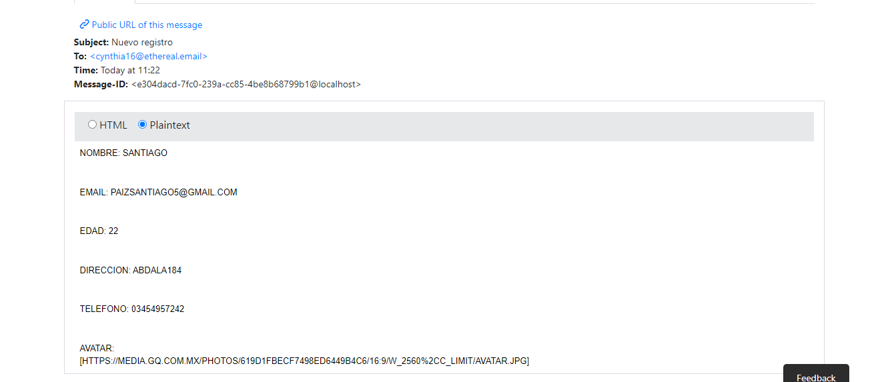

# Proyecto final
## _Gamerstore_

Gamerstore es una tienda online donde podes encontrar los mejores componentes para armar tu set up gamer. 
La cual cuenta con Registro y Login de usuarios, asi como tambien la posibilidad de subir tu producto, los cuales se almacenan en un servidor
de MongoAtlas.

## Frameworks utilizados

- Express
- Bcrypt
- Joi
- Mongoose
- Nodemailer
- Pug
- Twilio
- Passport
- Env

# Informacion del env

# Mail de registro

# Mail de pedido

# Mensaje de twilio

# Wspp de twilio

